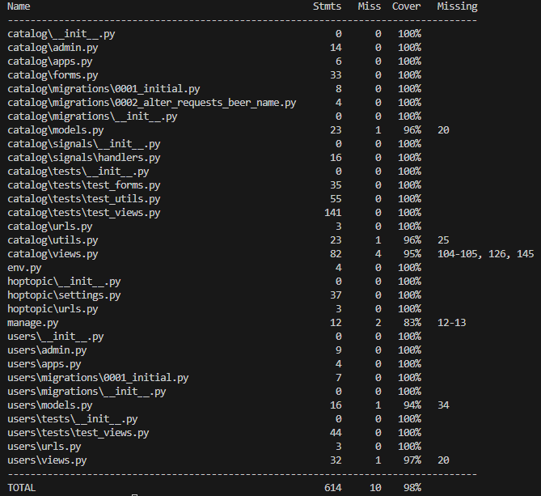

# Hop Topic

## Table of Contents
- [Introduction](#introduction)
- [User Experience](#user-experience)
- [Planning](#planning)
- [Features](#features)
- [Technologies Used](#technologies-used)
- [Testing](#testing)
- [Deployment](#deployment)
- [Forking and Cloning](#forking-and-cloning)
- [Credits](#credits)

## Introduction

**DISCLAIMER**: The API used to create this project no longer exists. If you wish to clone this repository for yourself, you will need to amend the apicall.py to gather data from an API of your choice.

The [Hop Topic](https://hop-topic-7a426dfa7c2e.herokuapp.com/) project is a full stack web application built with the Django framework.

The website allows users to view a database of beers, ranked by their average rating as given by other users, and any reviews that have been left on a beer. Registered users can leave reviews on beers, edit or delete any of their own existing reviews and send a request for new beers to be added to the database. Site superusers have full access to CRUD functionality for beers, reviews and requests.

[Back to the top](#table-of-contents)

## User Experience

### User Stories

- As a site user, I can:

1. View a paginated list of beers that is ranked by rating.
2. Follow a link to view the beer of the day.
3. Click on a beer from the paginated list to view more information about that beer.
4. View the reviews of a beer on any individual beer's page.
5. Search the beer database by name and keywords.
6. Filter the beer database by rating and ABV.
7. Follow a link to view a list of all reviews left by other users.
8. Search for another user by username to see all of their reviews.
9. Register an account so that I can further interact with the site.

- As a registered site user, I can:

1. Leave a review on a beer to share my thoughts with the community.
2. Edit or delete any reviews I have made.
3. Request for a beer to be added to the database.

- As a site superuser, I can:

1. Create, read, update and delete entries into the beer database.
2. Approve or disapprove reviews on a beer.
3. Create, read, update and delete reviews.
4. Approve or disapprove requests for beers to be added to the database.
5. Create, read, update and delete requests for beers to be added to the database.

[Back to the top](#table-of-contents)

## Planning

### Agile Methodology

The Agile Methodology was used to the plan the Hop Topic project through the use of the Github [Project Board](https://github.com/users/jfpaliga/projects/2/views/1).
User Stories were tracked using Github Issues and added to the 'Todo' section of the Kanban board. During sprints, the User Stories in focus were moved to 'In Progress' to keep a clear visual aid of what the current objectives were. On completion, the issues were moved to the 'Done' section.

### Database Models

To plan out the structure of the models used in the database, tables were created using [Lucidchart](https://www.lucidchart.com/pages/).

Three models were planned out for the site: a beer model, a review model and a request model. The beer model was planned out using the return from the [BrewDog API](https://punkapi.com/).

The values returned from the API gave rise to the fields, hence why a URLField was necessary for the image and a JSONField for the food pairings. The first brewed date was kept as a CharField to save having to manipulate the data to convert the value into a datetime object.

### Wireframes

Initial wireframes were built using [Balsamiq](https://balsamiq.com/). The wireframes were planned from a mobile perspective, with a rough plan drawn out for what the home page, beer detail page, all reviews page and request page would look like.

[Back to the top](#table-of-contents)

## Features

### Banner

On arrival at the page, a user is immediately greeted by the banner to draw their attention and let them know what website they are on and it's purpose. The banner is maintained across all pages to give the user a sense of consistency.

### Navigation

Above the banner on each page is the navigation bar, which allows the user to navigate the different pages of the website. The names of each navigation link are clear so a user knows exactly what to expect when clicking a link.

If a user is not signed in, the navigation bar changes to display a register and login link.

On a mobile device, the navigation bar is collapsible and can be accessed by clicked on the burger icon. This will then expand the bar to display the links vertically rather than horizontally so they are easier to view on a smaller screen.

### Home page

The home page of the site displays a paginated list of beers in the database, ordered by the highest average rating. This order is dynamic and will change on admin approval of new reviews or deletion of a review by a user.

The list is responsive, and the number of columns will change depending on the screen size. Navigation buttons at the bottom of the page allow a user to move through the paginated list.

### Search and Filter

If a user does not want to navigate manually through the entire list, they can use the search and filter options to narrow down the beers displayed to them.

The search bar will take a user's input and filter the displayed list to show any beers that contain the input in either the name, tagline or description of the beer.

There are also two filter dropdown menus that allow a user to either filter the displayed beers by rating or alcohol by volume (ABV).

### Beer Detail page

When a user clicks on a displayed beer from the home page, they will navigate to a more detailed page that gives the user more information about the beer. The beer's name, tagline and average rating are displayed at the top of the page to let the user know which beer they are looking at and what other users thought of it at a glance.

Below the image, further information is displayed which isn't found on the paginated list on the home page. The first brewed date and ABV are shown as well as a brief description of the beer and a list of foods that pair well with the beer.

When clicking on the 'Beer of the Day' link in the navigation bar, a user will be brought to this detailed page for a randomly selected beer.

### Reviews

Underneath the information about a beer on the beer detail page, a user can find the review section. Here they can view the reviews left by other users and, if they are signed in, they will see a form that allows them to submit their own review.

Reviews are only visible once they have been approved by a superuser. If the current user has submitted a review that has not yet been approved, they will see their review with a message to indicate that it is awaiting approval.

If a signed in user has already left a review on that beer's page, they will see the options to either edit their review or delete it.

Clicking edit will fill the form on the right with their comments and change the 'Submit' button to 'Update'.

Clicking delete will first display a modal to the user to confirm they wish to delete their review. Only after clicking delete again in this modal will a user's review be deleted from the database.

### All Reviews page

The All Reviews page displays a list of all reviews that have been made by users on the site, ordered by the date they were created. Each review item contains links to both the beer that has been reviewed and the user profile of the user who left the review.

The search bar at the top of this page also allows a user to search for a user to navigate to their profile.

### User Profile page

After following a username link on a review or by searching for a username, a user will see the profile page that displays the username of the user and a count of the approved reviews they have submitted.

A list of all reviews that user has made is also displayed.

### Request page

The Request a Beer page allows a user to fill out a form with the information on a beer that they wish to be added to the database. A superuser can then view a list of submitted requests on the admin page and decide whether or not to approve and any further action to take.

### Possible Future Features

- Allow login to the site using a social media account.
- Further development of the user profile page, including a profile picture and about section.
- Front end admin page for superusers.
- A 'favourite' option to allow users to add beers to a favourite list.

[Back to the top](#table-of-contents)

## Technologies Used

The technologies used throughout the planning, design, testing and deployment are listed below:

### Languages

- [HTML5](https://en.wikipedia.org/wiki/HTML5)
- [CSS](https://en.wikipedia.org/wiki/CSS)
- [JavaScript](https://www.javascript.com/)
- [Python](https://www.python.org/)

### Frameworks

- [Django](https://www.djangoproject.com/)
- [Bootstrap](https://getbootstrap.com/)

### Django Packages

- [Allauth](https://docs.allauth.org/en/latest/)

    For authentication, registration and account management

- [Cloudinary](https://cloudinary.com/)

    For storing user uploaded images

- [Crispy Forms](https://django-crispy-forms.readthedocs.io/en/latest/)

    For form styling and behaviour

- [Dj_database_url](https://pypi.org/project/dj-database-url/)

    To configure Django database using environment variables

- [Gunicorn](https://gunicorn.org/)

    As the server for Heroku deployment

- [Summernote](https://summernote.org/)

    For admin page form styling

- [Whitenoise](https://whitenoise.readthedocs.io/en/stable/)

    For static file serving

### Databases

- [PostgreSQL](https://www.postgresql.org/)

    Application database

- [ElephantSQL](https://www.elephantsql.com/)

    As a PostgreSQL database hosting service

### Others

- [Amazon Web Services](https://aws.amazon.com/)

    For image hosting and content delivery

- [Balsamiq](https://balsamiq.com/)

    For building project wireframes

- [Fontawesome](https://fontawesome.com/)

    For website icons

- [Git](https://git-scm.com/)

    For version control

- [Github](https://github.com/)

    As a code repository

- [Heroku](https://heroku.com)

    For application deployment

- [Lucidchart](https://lucid.app/)

    For creation of database model diagrams

- [VSCode](https://code.visualstudio.com/)

    Code editor used in development

[Back to the top](#table-of-contents)

## Testing

### Automated Tests

Unit tests were written using Django's TestCase extension of the standard library TestCase. The tests were stored in a separate test directory within each app and split into several files to cover each module separately. This meant that individual apps and modules could be tested separately to reduce testing time.

For example, if I wanted to only test the forms in the catalog app I could run

            python manage.py test catalog.tests.test_forms

Tests run on the catalog app: 33/33 successful with no errors or warnings found.

Tests run on the users app: 6/6 successful with no errors found.

Coverage was tested to ensure automated tests were effective in testing all of the code.

It was found that most modules had >= 95% coverage with the only exception being manage.py which is a Django managed module and not included in any of the written tests.

### Manual Testing

Manual tests were carried out throughout development, using the user stories as a benchmark to ensure functionality was as intended.

Deployment was carried out at a very early stage to ensure consistency between the development and live environments.

Additionally, user testing was carried out at several stages to ensure the site was intuitive and functional.

### Validator Testing

#### HTML Validation

All pages passed HTML validation with no errors using the W3C HTML validator.

The beer detail page has a warning about the article lacking a heading, however the content was relevant to the section so I believed no other semantic element was necessary.

#### CSS Validation

All custom CSS styling passed the W3C CSS validator without errors.

#### JavaScript Validation

All custom JavaScript was passed through the [JSHint](https://jshint.com/) validator and no errors or warnings were found.

#### Python Validation

All python code was tested using Code Institute's [PEP8 Linter](https://pep8ci.herokuapp.com/).

All code passed with no errors.

PEP8 testing for the catalog app

PEP8 testing for the users app

PEP8 testing for the apicall module

### Performance and Accessibility Testing

The performance and accessiblity of the app were tested using [Google Lighthouse](https://developer.chrome.com/docs/lighthouse/overview/) in Google Chrome.

Performance on mobile suffered due to the banner image. 

Attempts were made to reduce the load time by converting the image to the webp format and compressing the image, which slightly improved the performance.

Fetch priority was also set to high on the banner image, and low on other images in order to improve performance.

Ultimately, the decision was made to host the image and obtain through the AWS content delivery network (CDN) in order to optimise performance.

Performance on desktop was good.

Accessibility scores were high on both mobile and desktop.

[Back to the top](#table-of-contents)

## Deployment

### Heroku Deployment

The application was deployed using [Heroku](https://www.heroku.com/) following the procedure documented below.

1. Log into Heroku or create an account.
2. From the dashboard, click the **New** button in the top right and from the drop down menu select **Create new app**. If no apps have been created previously, the **Create new app** button can be selected directly from the dashboard home screen.
3. Choose a name for the app (this must be unique, for this app the name 'hop-topic' was chosen) and select the relevant region (in the case of this app, Europe), then press the **Create app** button.
4. Navigate to the **Settings** tab. The tabs can be found at the top of the page underneath the header.
5. Scroll down to the **Config Vars** section and click the **Reveal Config Vars** button.
6. If the application uses any data that is not included in the GitHub repository (ie sensitive data) then it can be included here. The GitHub repository of this project includes an env.sample file, which indicates which variables you require.
7. At the top of the page, navigate to the **Deploy** tab.
8. Scroll down to the **Deployment method** section and select GitHub.
9. Confirm the connection to GitHub by clicking the **Connect to GitHub** button.
10. In the new box that has appeared, enter the repository name and click the **Search** button.
11. When Heroku has found the correct repository, click the **Connect** button that appears below the search bar.
12. Scroll down to the bottom of the Deploy page and select one of the two deployment options:
    * In the Automatic deploy section, select the appropriate branch from the dropdown menu and click the **Enable Automatic Deploys** button. This will deploy the app automatically when an update is pushed to GitHub.
    * In the Manual deploy section, select the appropriate branch from the dropwdown menu and click the **Deploy Branch** button. This will only deploy the current branch. Any further updates will require the app to be re-deployed.

[Back to the top](#table-of-contents)

## Forking and Cloning

If you wish to fork and clone this repository, follow the instructions below.

### Forking

1. In the top right of the repository page, click the **Fork** button.
    
2. Under **Owner**, select the desired owner from the dropdown menu.
3. **OPTIONAL :** Change the default name of the repository in order to distinguish it.
3. **OPTIONAL :** In the **Description** field, enter a description for the forked repository.
4. Ensure the 'Copy the main branch only' checkbox is selected.
5. Click the **Create fork** button.

### Cloning the Forked Repository

To clone the fork onto your local system, in your IDE Terminal enter the following command:

    git clone https://github.com/jfpaliga/hop-topic.git

### Installing Requirements

In order to ensure all the correct dependencies are installed in your local environment, run the following command in the terminal:

    pip install -r requirements.txt

### Environment Variables

The env.sample file within the repository details the variables that you will need in order for the application to run.

When adding any environment variables to your local environment, ensure that `env.py` is added to `git.ignore` so that no sensitive information is pushed to Github.

### Final Setup

1. Migrate the application models to the database by running `python manage.py migrate` in the terminal.
2. Create a superuser by running `python manage.py createsuperuser` in the terminal
3. Run the server by running `python manage.py runserver` in the terminal. Ensure `DEBUG = True` to get more information about any errors that may occur. Be careful to set `DEBUG = False` before deployment to a live environment.

[Back to the top](#table-of-contents)

## Credits

### Content

- All information on beers were taken from [Punk API](https://punkapi.com/), which has gathered the information in turn from [Brewdog's DIY Dog](https://www.brewdog.com/uk/diy-dog).
- The banner image was taken from [Unsplash](https://unsplash.com/).

### Acknowledgements

- I would like to thank my CodeInstitute Mentor, Okwudiri Okoro, for all of his help in this project and in particular regard to signals, handlers and decorators.
- I would like to thank my friends Chris Blunt and Kyle Oxberry, for their assistance and feedback in user testing.

[Back to the top](#table-of-contents)
